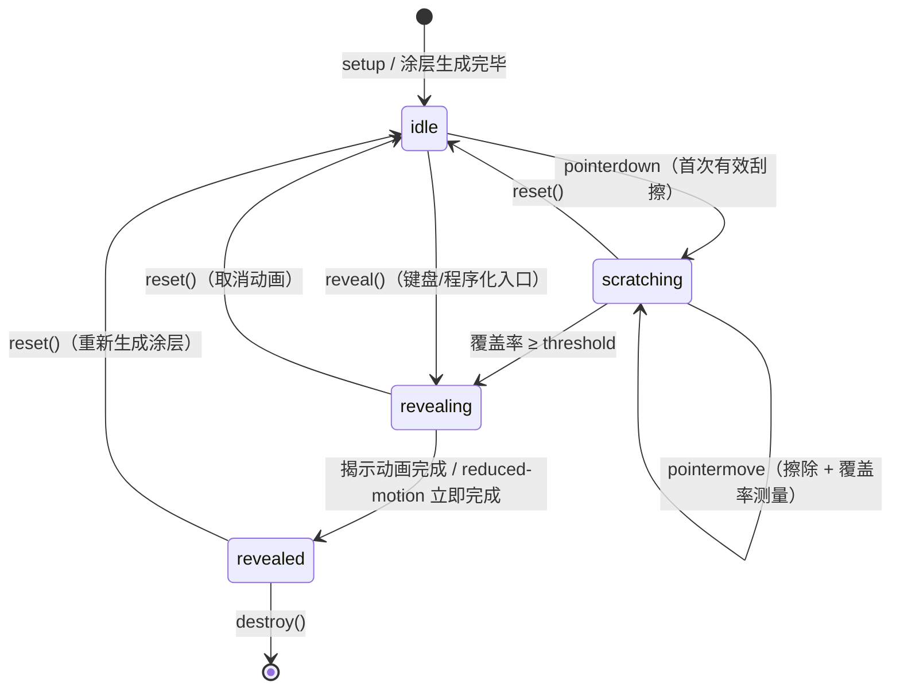

# 刮刮卡效果技术设计方案

> 状态：设计稿（未实现）。本文档只产出设计，不修改/新增任何源码。
> 目标工程：Vite 8 + TypeScript 6 vanilla 脚手架，无运行时依赖，严格 tsconfig。

---

## A. 现有工程理解小结

### A1. `main.ts` 的 DOM 注入方式

现状：`main.ts` 通过 `document.querySelector<HTMLDivElement>('#app')!.innerHTML = \`...\`` 一次性注入整页静态结构，随后用 `document.querySelector` 取出具体元素，调用 `setupXxx(element)` 激活交互。

**对方案的约束映射**：
- 刮刮卡的静态外壳（卡片容器、奖品层占位）应作为模板字符串的一部分随 `innerHTML` 注入，而不是由模块自己 `createElement` 拼整棵树——与现有风格一致。
- 模块入口形态为 `setupScratchCard(element, options)`，在 `innerHTML` 注入之后、与 `setupCounter(...)` 并列的位置调用。
- 模块内部只允许在挂载点**内部**创建必要的动态节点（`<canvas>`、aria-live 节点等），不越界操作 `#app` 之外的 DOM。

### A2. `counter.ts` 的事件绑定范式

现状：`setupCounter(element)` 接收已存在的元素，用闭包保存私有状态（`counter`），用 `element.addEventListener` 绑定事件，定义内部纯函数 `setCounter` 收敛所有状态变更，并在末尾做一次初始化调用使组件自洽。

**对方案的启示（直接沿用）**：
- 导出一个 `setupScratchCard(element, options)` 纯函数，无类、无全局单例，状态全部放闭包——天然支持同页多实例。
- 所有状态变更收敛到一个内部 `transition(next)` 函数（对应 `setCounter` 的角色），避免状态散落赋值。
- 与 `counter.ts` 的差异点：`counter` 不需要清理，但刮刮卡持有 rAF、Pointer 监听、ResizeObserver，SPA 场景必须可回收，因此返回值从 `void` 升级为 `ScratchCardHandle { reset, reveal, destroy }`。这是对范式最小的、必要的扩展。

### A3. `style.css` 的主题体系

现状：`:root` 上定义 `--text / --bg / --accent / --border / --shadow` 等 CSS 变量，`@media (prefers-color-scheme: dark)` 内整体覆盖；`:root` 声明 `color-scheme: light dark`；无手动主题开关。样式用嵌套语法（Vite 原生支持）。

**对方案的约束映射**：
- 新增一组 `--scratch-*` 变量（涂层基色、涂层高光、揭奖态背景、焦点色复用 `--accent`），light 值放 `:root`，dark 值放进现有 dark media 块，不引入 `[data-theme]` 之类的第二套主题机制。
- 涂层是 canvas 绘制的，**canvas 读不到 `var()`**：生成涂层时用 `getComputedStyle(document.documentElement).getPropertyValue('--scratch-coat-1')` 等把变量值取回 JS，并监听 `matchMedia('(prefers-color-scheme: dark)')` 变化重新生成涂层（仅在 `idle` 态重生成，刮到一半换主题不打断，见 D）。
- 揭奖态（奖品层）是纯 DOM，直接用变量即可，无此问题。

### A4. tsconfig 严格项禁止的写法

| 编译选项 | 禁止的写法 | 本方案的规避 |
|---|---|---|
| `verbatimModuleSyntax` | 类型与值混用导入（`import { Foo }` 但 `Foo` 只是类型），否则运行时会真的去取这个不存在的导出 | 所有纯类型一律 `import type { ... }`；类型集中放 `types.ts`，该文件只含 `type`/`interface`，零运行时代码 |
| `erasableSyntaxOnly` | `enum`、`namespace`、`constructor(private x)` 参数属性等"需要生成运行时代码"的 TS 语法 | 状态机不用 `enum`，用字符串字面量联合类型 `type State = 'idle' \| 'scratching' \| ...`；不用 `namespace`；不用类（自然避开参数属性） |
| `noUnusedLocals` / `noUnusedParameters` | 未使用的局部变量/参数 | 事件回调里用不到的参数直接不声明；必须声明但不用的以 `_` 前缀（TS 对 `_` 开头参数豁免）；设计稿中的 API 不预留"将来可能用"的参数 |
| `allowImportingTsExtensions` + 现有风格 | —（这是允许项） | 相对导入一律带 `.ts` 扩展名，与 `main.ts` 中 `from './counter.ts'` 保持一致 |
| `noFallthroughCasesInSwitch` | switch 穿透 | 状态机若用 switch，每个分支显式 `break`/`return` |

### A5. 零运行时依赖

`package.json` 只有 `typescript` 和 `vite` 两个 devDependency。**本方案不引入任何第三方库**，全部使用原生 Web API：Canvas 2D（含 `globalCompositeOperation`）、Pointer Events、`requestAnimationFrame`、`ResizeObserver`、`matchMedia`、`AbortController`、`getComputedStyle`。这些 API 在目标 `es2023` + 现代浏览器中全部原生可用，无需 polyfill；不支持的走降级路径（见 E）。

---

## B. 模块与文件结构设计

### B1. 新增文件（设计，未创建）

```
src/
  scratch-card/
    types.ts        # 纯类型：State、Options、Handle、PrizeContent。零运行时代码
    coating.ts      # 程序化生成银色涂层（渐变+噪点+高光+提示文字），主题色采样
    coverage.ts     # 覆盖率检测：离屏小 canvas 降采样 + rAF 节流
    scratch-card.ts # 编排层：DOM 组装、Pointer 事件、状态机、揭示动画、destroy
    index.ts        # 桶文件：export type * / export { setupScratchCard }
src/style.css       # 追加 --scratch-* 变量（light/dark 两处）与 .scratch-card 样式块
src/main.ts         # 模板字符串追加卡片外壳 + 一行 setupScratchCard(...) 调用
```

职责切分理由：`coating`（纯绘制，无事件）、`coverage`（纯计算，无 DOM）、`scratch-card`（有副作用的编排）三者变化原因不同，分开后每个模块可独立理解与测试；不进一步拆 `pointer.ts`/`state-machine.ts`，因为各自不足百行，再拆只剩跳转成本。**否决的备选**：单文件 `scratch.ts`——擦除、采样、涂层生成、状态机揉在一起会超过 400 行，违背现有"一个文件一个小组件"的观感；也否决按"框架式"目录（`components/`、`hooks/`）分层——本项目是 vanilla，无此惯例。

### B2. 对外 API 签名（仅类型，无实现体）

```ts
// src/scratch-card/types.ts
export type ScratchCardState =
  | 'idle'        // 涂层完整，等待首次刮擦
  | 'scratching'  // 用户刮擦中（至少刮过一笔，未达阈值）
  | 'revealing'   // 已达阈值或程序化触发，完全揭示动画进行中
  | 'revealed'    // 完全揭示，奖品可操作

export interface ScratchPrizeContent {
  readonly text?: string        // 主文案，如 "¥5 优惠券"
  readonly subText?: string     // 次文案，如 "点击领取"
  readonly imageUrl?: string    // 奖品图；与文字可叠加共存
  readonly imageAlt?: string
}

export interface ScratchCardOptions {
  readonly prize: ScratchPrizeContent
  readonly brushRadius?: number       // 笔刷半径，CSS px，默认 24
  readonly threshold?: number         // 触发完全揭示的覆盖率，0~1，默认 0.7
  readonly revealDurationMs?: number  // 揭示动画时长，默认 600；reduced-motion 时强制 0
  readonly onStateChange?: (state: ScratchCardState) => void
  readonly onReveal?: () => void      // 进入 revealed 时回调一次（埋点/领奖入口）
}

export interface ScratchCardHandle {
  readonly state: ScratchCardState    // getter，只读暴露当前状态
  reset(): void                       // 任意状态 → idle，重新生成涂层
  reveal(): void                      // 程序化揭示（键盘/无障碍入口），走同一状态机
  destroy(): void                     // 移除全部监听/rAF/observer，释放 canvas
}

// src/scratch-card/index.ts
export function setupScratchCard(
  element: HTMLElement,
  options: ScratchCardOptions,
): ScratchCardHandle
```

### B3. 挂载点 DOM 结构（模块在 `element` 内部组装）

```html
<div class="scratch-card" data-state="idle">
  <div class="scratch-card__prize">…text/subText/img…</div>
  <canvas class="scratch-card__canvas" aria-hidden="true"></canvas>
  <button type="button" class="scratch-card__reveal visually-hidden">揭晓奖品</button>
  <p class="scratch-card__live visually-hidden" aria-live="polite"></p>
</div>
```

要点：canvas 绝对定位覆盖在奖品层上；`data-state` 由 JS 状态机唯一写入，CSS 全部挂在这个属性选择器上（这是"防 CSS 绕过"的关键，见 F）；隐藏按钮是键盘/读屏的等价入口。

### B4. 接入 `main.ts`（示意 diff，不执行）

```
 <button id="counter" type="button" class="counter"></button>
+<div id="scratch" class="scratch-slot"></div>
```

```ts
import { setupScratchCard } from './scratch-card/index.ts'

setupCounter(document.querySelector<HTMLButtonElement>('#counter')!)
setupScratchCard(document.querySelector<HTMLElement>('#scratch')!, {
  prize: { text: '¥5 优惠券', subText: '刮开领取', imageUrl: viteLogo, imageAlt: '' },
})
```

与现有风格完全一致：模板注入外壳 → 查询元素 → setup 函数激活。

---

## C. 核心算法说明（伪代码，非可运行代码）

### C1. 擦除绘制：合成模式选型与快速滑动不断线

**选型：`globalCompositeOperation = 'destination-out'`。** 原理：该模式下新绘制的形状会把已有像素的 alpha 按形状覆盖率扣减——画到哪，涂层透明到哪，露出下方 DOM 奖品层。

否决的备选：
- **直接 `clearRect`/圆形 `clearPath`**：只能清矩形或需逐圆 `arc + clear` 的变通，画连续笔迹要手动拼接，且无法利用抗锯齿边缘，刮痕边缘锯齿明显。
- **`'xor'` / 重绘整张涂层**：xor 来回刮会"刮回去"，语义错误；每帧全量重绘涂层再挖洞是 O(全图) 绘制，浪费。
- **CSS mask / clip-path**：擦除区域需要动态累积成百上千个圆，DOM/CSS 表达力与性能都不够，且无法做覆盖率采样（见 C3 需要位图）。

**不断线**：pointermove 事件的点位在高刷新率/快速滑动下是稀疏的，两点间必须连线而不是只画圆点。伪代码：

```
function eraseStroke(from, to):
  ctx.globalCompositeOperation = 'destination-out'
  ctx.lineCap = 'round'; ctx.lineJoin = 'round'
  ctx.lineWidth = brushRadius * 2
  ctx.beginPath(); ctx.moveTo(from); ctx.lineTo(to); ctx.stroke()

onPointerMove(e):
  if not drawing: return
  for p in e.getCoalescedEvents():   // 取出一帧内被合并的中间点，高刷屏不断线
    cur = toLogical(p)
    eraseStroke(last, cur)
    last = cur
  dirty = true                        // 通知覆盖率检测（C3）
```

要点：① `getCoalescedEvents()` 补齐一帧内被浏览器合并的点，120Hz 触控板/手写笔下尤其关键；② 单点 pointerdown 也要 `stroke` 一个零长线段（round cap 退化为圆点），否则单击不刮；③ 每段独立 `beginPath`，避免路径无限累积导致 stroke 越来越慢。**否决的备选**：沿线段按间距手动 stamp 圆——效果等价但绘制调用次数高一个量级；二次贝塞尔平滑——刮痕不需要美观曲线，徒增复杂度。

### C2. HiDPI 坐标换算：逻辑坐标 / CSS 像素 / 设备像素

三套单位必须分清：**canvas  backing store**（`canvas.width/height`，设备像素）、**CSS 布局尺寸**（`getBoundingClientRect()`，CSS px）、**PointerEvent 坐标**（`clientX/Y`，CSS px 视口坐标）。

```
function resizeCanvas():
  rect = canvas.getBoundingClientRect()          // CSS px
  dpr  = window.devicePixelRatio || 1
  canvas.width  = round(rect.width  * dpr)       // 设备像素，清晰不模糊
  canvas.height = round(rect.height * dpr)
  ctx.setTransform(dpr, 0, 0, dpr, 0, 0)         // 之后全部用 CSS px 作画
  regenerateCoating()                            // 尺寸变了必须重画涂层

function toLogical(e):                            // 事件坐标 → 画布逻辑坐标
  rect = cachedRect                               // pointerdown 时取并缓存，手势期间不变
  return (e.clientX - rect.left, e.clientY - rect.top)   // 恰好是 CSS px，与 setTransform 匹配
```

要点与取舍：
- **`setTransform(dpr,...)` 一次设定，之后全部按 CSS px 思考**：笔刷半径、坐标、覆盖率阈值全部以 CSS px 为单位，避免代码里到处乘除 dpr（触控偏移、细线断裂的经典根因就是某处漏乘/重复乘 dpr）。
- **不用 `offsetX/offsetY`**：规范对嵌套/变换元素的历史行为不一致，`clientX - rect.left` 语义最直白。
- **rect 缓存**：`getBoundingClientRect` 触发布局，手势期间每事件调用浪费；在 `pointerdown` 取一次缓存，ResizeObserver/scroll 时失效重取。
- **dpr 变化**（拖窗口到另一块屏、浏览器缩放）：监听 `matchMedia('(resolution: Xdppx)')` 或退化为 resize 时重读 dpr；尺寸变化后涂层重生成、**已刮进度丢失**——这是被接受的取舍（刮到一半改窗口尺寸是低频场景，重刮成本可接受；备选"位图缩放迁移旧进度"会产生模糊涂层，否决）。
- 触控笔/触摸的 `e.width/height`（接触面）不用于动态笔刷——保持笔刷恒定，行为可预期，覆盖率检测也更稳定。

### C3. 覆盖率检测：为什么不能每次移动都全图 `getImageData`

**问题**：`getImageData` 是 GPU→CPU 同步回读。一张 1126px 宽卡片在 dpr=2 下 backing store 约 2252×700 ≈ 158 万像素 ≈ 6.3MB。pointermove 每帧触发一次全图回读，意味着每帧强制渲染管线同步停顿 + 6MB 内存搬运，移动端直接掉帧、发热。这是刮刮卡最常见的性能事故。

**选型：离屏小 canvas 降采样 + rAF 节流。** 原理：把主 canvas 缩绘到一张固定 64×36 的离屏 canvas（`drawImage` 在 GPU 侧完成缩放，极快），只对这 2304 个像素 `getImageData`，统计 alpha < 128 的比例即覆盖率。

```
const SAMPLE_W = 64, SAMPLE_H = 36               // 采样网格，与卡片宽高比一致
sampleCanvas, sctx = 离屏创建一次，复用

onPointerMove: ... dirty = true; scheduleMeasure()

function scheduleMeasure():
  if rafPending: return                          // 每帧最多测一次
  rafPending = true
  rafId = requestAnimationFrame(measure)

function measure():
  rafPending = false
  if not dirty: return
  dirty = false
  sctx.drawImage(mainCanvas, 0, 0, SAMPLE_W, SAMPLE_H)
  data = sctx.getImageData(0, 0, SAMPLE_W, SAMPLE_H).data
  cleared = count(i where data[i*4+3] < 128)
  ratio = cleared / (SAMPLE_W * SAMPLE_H)
  if state == 'scratching' and ratio >= threshold:
    transition('revealing')
```

**复杂度分析**：全图方案每次测量 O(W×H) ≈ 1.6M 像素 + 同步停顿；降采样后 `drawImage` 缩放 O(1)（GPU），回读 O(64×36) = 2304 像素 ≈ 9KB，每帧至多一次（rAF 节流），每秒上限 60 次 × 9KB ≈ 0.5MB/s，可忽略。采样误差：64×36 网格下单像素权重 0.043%，阈值 70% 的判定误差远小于人眼对"刮开七成"的感知，可接受。

**否决的备选**：
- **JS 侧网格计数**（把卡片划成 N×M 逻辑格，笔刷经过就标记）：O(1) 且无回读，但它是"笔刷轨迹覆盖率"而非"实际擦除覆盖率"——格子被笔刷边缘蹭到即记为已刮，系统性高估，阈值 70% 可能实际只刮了 50%；且 reset、resize 时要额外维护。作为唯一判据被否决，但其思想保留为采样网格的直觉解释。
- **提高采样分辨率（如 256×144）**：精度收益边际递减，回读成本平方增长，否决。
- **`OffscreenCanvas` + Worker**：当前数据量完全用不上，引入 Worker 对 vanilla 脚手架是过度工程，否决。

### C4. Pointer Events 统一输入与 iOS 滚动/缩放处理

**选型：Pointer Events 一套代码覆盖鼠标/触摸/触控笔**（`pointerdown/move/up/cancel`），`pointerdown` 上 `setPointerCapture(e.pointerId)` 保证划出元素外手势不中断。iOS Safari 13+ 已支持，符合"现代浏览器"目标。否决：mouse+touch 双套监听（重复逻辑、触摸还要手动防 300ms 鼠标事件回灌）；`touch-action` 见下。

**iOS 刮卡时页面滚动与双指缩放**：
- 主手段是 CSS：`canvas { touch-action: none; user-select: none; -webkit-user-select: none; -webkit-touch-callout: none; }`。`touch-action: none` 告诉浏览器该元素上的触摸不触发滚动/缩放，事件全部交给 JS——这正是刮卡需要的。
- **否决"全局 `preventDefault`"**：在 `touchmove` 上 `{ passive: false }` + `preventDefault()` 是旧方案，缺点是整个文档的滚动性能都要为被动监听器让路，且 iOS 对 document 级 touchmove 的 preventDefault 限制越来越多。仅在 `touch-action` 缺失的老 iOS（<13）作为兜底分支存在，默认路径不注册任何非 passive 监听器。
- 双指缩放：iOS Safari 忽略 `user-scalable=no`，用 `gesturestart` 监听 `preventDefault()` 兜底（仅 iOS 私有事件，特性检测后注册）。
- `pointercancel`（系统手势打断、来电）必须与 `pointerup` 走同一结束路径，否则 `drawing` 标志卡死。

### C5. 降级路径

| 能力缺失 | 检测 | 降级行为 |
|---|---|---|
| Canvas 2D 上下文 | `canvas.getContext('2d')` 返回 null | 不渲染涂层，直接展示奖品层 + 提示文案，功能等价"已揭晓" |
| Pointer Events | `'PointerEvent' in window` | 回退 mouse/touch 双套监听（同一 `eraseStroke` 核心）；触摸分支才注册 `{ passive: false }` 的 touchmove |
| `getCoalescedEvents` | 方法存在性 | 直接用事件本身单点，效果略糙但正确 |
| `ResizeObserver` | 构造器存在性 | 退化为 `window resize` 监听 |
| 全部 JS 失效 | — | 纯静态：奖品层默认不被覆盖（无 JS 则不插入 canvas），内容可直接阅读 |

---

## D. 状态机：刮卡生命周期



文字版不变式与竞态处理：

1. **`idle`**：涂层完整，奖品层 `visibility: hidden`（防 CSS 绕过，见 F）。只响应 `pointerdown` 与 `reveal()`。
2. **`scratching`**：接受擦除输入；rAF 测量循环仅在此状态运行。
3. **阈值触发（`scratching → revealing`）的竞态**：用户达到阈值的瞬间手指仍在屏幕上继续 move。处理：进入 `revealing` 后立即 `drawing = false` 并忽略后续所有 pointer 输入（状态守卫 `if state != 'scratching' return`），已 capture 的 pointer 在 `transition` 中 `releasePointerCapture`。测量函数内先判状态再判阈值，同一帧不会重复触发。
4. **`revealing`**：播放涂层淡出（CSS opacity transition 由 `data-state` 驱动，时长 `revealDurationMs`；`prefers-reduced-motion` 时 CSS 把时长压为 0）。`transitionend` 或 0ms 超时后置 `revealed`。**动画进行中调 `reset()`**：取消 transition 监听、强制清掉涂层、重生成，直接回 `idle`——所有动画完成回调里都先校验"当前状态仍是 revealing"，过期的 `transitionend` 不会把已 reset 的卡错误推进到 `revealed`。
5. **`revealed`**：canvas `pointer-events: none` 并淡出移除，奖品可交互，`onReveal` 恰好回调一次（在 `transition` 内触发，不在多处补调）。
6. **`reset()`**：任意非 idle 状态 → 停 rAF、清 canvas、重生成涂层、`data-state=idle`。幂等，重复调用安全。
7. **主题切换**：dark/light 变化时仅当 `state == 'idle'` 重生成涂层；其他状态延迟到下一次 `reset()` 自然生效——避免刮到一半涂层颜色突变或进度丢失。

所有迁移收敛在 `transition(next)` 一个函数：校验合法迁移表 → 更新闭包 `state` → 写 `data-state` → 调 `onStateChange`。非法迁移（如 `idle → revealed` 跳级）直接拒绝，状态机不可能进入未定义组合。

---

## E. 兼容性 / 性能 / 无障碍 / 降级策略矩阵

| 维度 | 场景 | 策略 | 取舍说明 |
|---|---|---|---|
| 兼容性 | 现代浏览器（Chrome/Edge/Firefox/Safari 近 3 个大版本） | Pointer Events + Canvas 2D + RO + rAF 全量路径 | 目标 `es2023`，不 transpile 降级 |
| 兼容性 | 无 Pointer Events（iOS <13 等） | mouse/touch 双套回退，共享 `eraseStroke` | 回退代码隔离在一个分支内，不污染主路径 |
| 兼容性 | 无 Canvas 2D | 直接展示奖品 + 提示 | 功能可用优先于形式完整 |
| 兼容性 | iOS 滚动/缩放冲突 | `touch-action: none` 为主，`gesturestart` preventDefault 兜底 | 不用全局非 passive preventDefault，保护页面滚动性能 |
| 性能 | 擦除绘制 | `destination-out` 线段 + coalesced events | 每事件 O(1) 次 stroke |
| 性能 | 覆盖率检测 | 64×36 离屏降采样 + rAF 节流 + dirty 标记 | 每帧 ≤1 次 9KB 回读，详见 C3 |
| 性能 | 布局读取 | `getBoundingClientRect` 手势级缓存 | 避免 per-event forced reflow |
| 性能 | 涂层噪点 | 128×128 小噪点 canvas → `createPattern` 平铺 | 避免对全图逐像素写 ImageData |
| 内存 | SPA 卸载 | `destroy()`：AbortController 一次性移除全部监听、cancel rAF、断开 RO/matchMedia、canvas 宽高置 0 | 单一 AbortController 信号贯穿所有 addEventListener，杜绝漏删 |
| 无障碍 | 键盘 | 聚焦隐藏"揭晓奖品"按钮，Enter/Space → `reveal()` 走同一状态机 | 不为键盘另写揭示逻辑，行为必然一致 |
| 无障碍 | 屏幕阅读器 | canvas `aria-hidden`；奖品文本本身在 DOM 中可读；`aria-live="polite"` 区域在 revealed 时播报结果 | 奖品不用纯 canvas 绘制，文本天然可及 |
| 无障碍 | 动效敏感 | `@media (prefers-reduced-motion: reduce)` 将揭示动画时长压为 0，瞬间呈现 | 只砍动效，不砍功能 |
| 主题 | light/dark | `--scratch-*` 变量双份定义；涂层生成时 `getComputedStyle` 采样；`idle` 态监听主题变化重生成 | canvas 无法直接用 var()，采样是唯一桥 |

---

## F. 风险与取舍清单（bug 高发点 → 规避设计）

1. **tsconfig 反制**：`verbatimModuleSyntax` 下把类型当值导入会在运行时炸；`erasableSyntaxOnly` 下写 `enum` 直接编译失败。规避：类型全部 `import type`、状态用字符串联合类型、不用类；每轮实现后跑 `npm run build`（`tsc && vite build`）作为硬门禁。
2. **HiDPI 偏移/细线断裂**：根因是 backing store、CSS px、事件坐标三套单位混用。规避：C2 的"一次 `setTransform(dpr)` + 全程 CSS px"纪律；`dpr` 变化与 resize 走同一 `resizeCanvas()` 重生成路径。
3. **触控滚动冲突**：iOS 上边刮边滚页面、双指误缩放。规避：`touch-action: none` 写在 canvas 上而非全局；`gesturestart` 兜底；不用全局非 passive 监听器牺牲整页滚动性能。
4. **阈值/动画/输入三者竞态**：达标瞬间用户还在刮、`reset` 与 `transitionend` 赛跑。规避：D 节状态机——`revealing` 起即拒收输入并 release capture；所有异步回调（rAF、transitionend、timer）入口先校验当前状态，过期回调直接丢弃。
5. **内存泄漏（SPA）**：监听器/rAF/observer 漏清理。规避：单一 `AbortController` + `destroy()` 集中回收；`destroy` 后所有公开方法变为安全 no-op。
6. **CSS 绕过揭奖**：威胁模型定为"会开 DevTools 改样式的普通用户"，不是"能改 JS 的攻击者"（纯前端无法防御后者，真实兑奖必须服务端校验，此处仅做客户端体验层防护）。三层设计：
   - **状态门控**：奖品层 `visibility` 由 `.scratch-card[data-state=...]` 选择器控制，`idle` 时隐藏；`data-state` 只能由 JS 状态机写入，单纯把 canvas 设为 `display:none` 只能看到隐藏的奖品层。
   - **完整性看门狗**：覆盖率测量顺带（每 N 帧一次，非每帧）校验 `canvas.isConnected` 及 computed `display/visibility/opacity` 未被篡改，异常则强制 `reset()` 回 `idle`（奖品重新隐藏）。
   - **领奖动作门控**：`onReveal`/领奖按钮只在 `revealed` 态渲染可用，而 `revealed` 只能由真实覆盖率或显式 `reveal()` 到达。
   - 取舍：看门狗是抽查而非每帧全量 computed style 读取（性能）；不采用"奖品也画进 canvas"的强隔离方案——那会牺牲文本可选中、读屏可及、主题变量复用，代价远超收益。
7. **涂层"假银色"**：纯色填充观感廉价。规避：coating.ts 程序化生成——对角线性渐变（主题采样两档银色）+ 噪点 pattern 颗粒感 + 斜向高光条带 + 居中"刮一刮"提示文字；全部 canvas 绘制，零图片资源，符合"不提供现成图片"约束。
8. **resize 丢进度**：接受为已知行为（低频、恢复成本低），文档化而非掩盖；备选位图迁移因模糊问题否决（见 C2）。

---

## G. 后续实现分轮计划（每轮可独立验证）

| 轮次 | 内容 | 验证标准 |
|---|---|---|
| R1 骨架与涂层 | `types.ts`、DOM 组装、`coating.ts` 程序化银色涂层、`--scratch-*` 变量接入 light/dark | 页面出现银色卡片；切系统主题后 reset 涂层颜色跟随；`npm run build` 通过 |
| R2 擦除与 HiDPI | `resizeCanvas` + dpr 换算、Pointer 擦除（coalesced、round 线段）、`touch-action` | 鼠标/触摸刮出平滑圆头刮痕；dpr=2 屏无偏移无断线；iOS 刮卡不滚页 |
| R3 覆盖率与状态机 | `coverage.ts` 降采样测量、`transition()` 状态机、阈值触发 | 刮约 70% 自动进入揭示；DevTools 里观察 `data-state` 迁移序列正确 |
| R4 揭示与重置 | 揭示动画（含 reduced-motion 归零）、`reset()`、`reveal()`、`onReveal` 单次回调 | 动画完成进 `revealed`；动画中 reset 无残留；重复 reset 幂等 |
| R5 健壮性 | `destroy()` + AbortController、降级路径（无 PE/无 canvas）、看门狗防绕过 | 反复挂载/卸载无监听器泄漏（Performance 面板）；隐藏 canvas 看不到奖品并被 reset |
| R6 无障碍与收尾 | 键盘揭示按钮、aria-live 播报、焦点样式复用 `--accent`、文档注释 | 纯键盘可完成揭示；读屏器播报奖品；`npm run build` 与 `vite preview` 全绿 |

每轮结束跑 `npm run build`（含 `tsc` 严格检查）作为合并门禁；R2、R3 是风险最高轮次，优先在真机 iOS Safari 验证。
