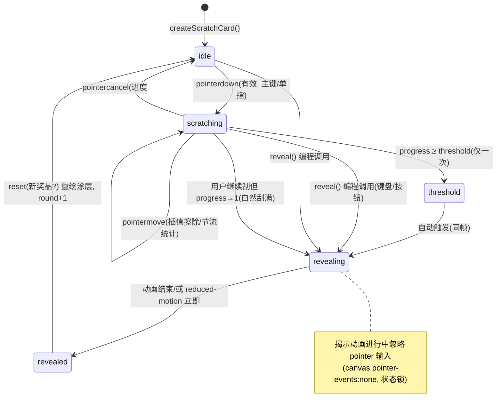

# 前端刮刮卡效果 · 技术设计文档

> 项目：`scratch-card-ts`（Vite 8 + TypeScript 6，vanilla 空白脚手架）
> 日期：2026-09-27
> 定位：设计阶段产出，**只新增本设计文档，不修改/新增任何源码**；后续实现须遵守文末硬性约束。

---

## A 现有工程理解小结（五点结论 → 对方案的约束映射）

### A1. `main.ts`：`innerHTML` 一次性注入 + 模块初始化函数收尾
**事实**：`src/main.ts` 先侧效导入 CSS（`import './style.css'`）和静态资源（Vite 会对 `.png/.svg` 生成带 hash 的生产路径，不能硬编码 `src="x.png"`），然后用一条模板字符串给 `#app.innerHTML` 注入整页结构，最后 `setupCounter(querySelector(...))` 做事件绑定。

**对方案的约束**：
- 新模块**不应自己 `document.body.append` 或改 `document.title`**；应仿照 `setupCounter` 的"先注入占位、再初始化"时序：工厂 `createScratchCard(options)` 返回带 `element` 的 handle，由 `main.ts` 在 `innerHTML` 之后把 `element` 挂载到占位节点（见 B3）。
  - 字符串里图片路径只能用 Vite 处理后的 URL 变量插值（`${img}`）；若模块自建 DOM，优先用 `document.createElement` + classList + 数据驱动渲染，减少大段 HTML 字符串——因为奖品数据是动态的（文字/图片叠加），字符串拼接易出引号转义问题。
- 侧效导入风格上可在 `main.ts` 加 `import './scratches/scratch.css'`（与 `import './style.css'` 1 行之差），但更内聚的做法是在工厂内对样式注入做一次守卫（仅首次调用时在 `<head>` 注入一个 `<style id="...">`），使模块自包含、可独立测试；文档后面采后者为默认（单例守卫）。

### A2. `counter.ts`：闭包 + 单元素参数 + 一张白纸起手
**事实**：`setupCounter(element: HTMLButtonElement)` 把所有状态（`counter`）藏在闭包里，外部只能通过元素和函数调用间接地改变它；入口接收一个已存在的元素，不碰其他地方；只绑定一个 `click` 而不全局监听。

**对方案的约束（API 设计启示）**：
- 模块对外只暴露一个工厂 `createScratchCard(options: ScratchCardOptions): ScratchCardHandle`（宿主不传入，由 `handle.element` 输出，便于一次构建多处挂载），内部状态全部闭包私有；`handle` 上仅给出命令式最小面（`reset` / `destroy` / 事件订阅）。
- 事件只绑定在模块自有的 DOM（canvas / 按钮）上，不污染 `window`（除可清理的 `pointerup`、媒体查询监听，且必须在 `destroy` 时解绑）。
- 像 `counter` 一样支持"同一页多个实例"：每个调用创建独立闭包与画布，不使用模块级可变状态（仅允许只读常量/幂等样式注入守卫）。

### A3. `style.css`：CSS 变量 + `prefers-color-scheme` 双主题
**事实**：`:root` 定义 `--text/--text-h/--bg/--border/--accent/--shadow` 等，`@media (prefers-color-scheme: dark)` 整体换值；`color-scheme: light dark` 已声明；无 `[data-theme]` 切换器，当前主题由系统决定。

**对方案的约束**：
- 刮卡新增颜色**一律以变量形式挂到 `:root`（light 默认值）与 dark 媒体块里**：如 `--scratch-cover-1/2`（银色金属渐变两端）、`--scratch-cover-edge`、`--scratch-prize-bg`、`--scratch-prize-border`、`--scratch-hint`，并复用现有 `--bg/--text-h/--border/--shadow/--accent`。
- 银色涂层用 canvas 程序化绘制，颜色不能写死：运行时通过 `getComputedStyle(document.documentElement).getPropertyValue('--scratch-cover-1')` 读取主题色；监听 `matchMedia('(prefers-color-scheme: dark)').addEventListener('change', ...)` 在**未刮状态（idle）下重绘涂层**，刮过的卡不重绘（避免擦掉用户进度）。
- 揭奖态（revealed）是普通 DOM 层，直接吃变量即可随主题换肤；涂层质感参数（高光、噪点、拉丝）用固定数值（与亮度无关的结构性效果），颜色随变量。

### A4. 严格 tsconfig：四类被禁止/受限的写法
**事实**（`tsconfig.json`）：
- `verbatimModuleSyntax: true`：类型必须用 `import type { X }` 显式标注；不允许 `import { SomeType } from value-position`，也不允许默认的类型再导出（`export { X }` 若 X 仅为类型会报错，需 `export type { X }`）。`import './x.css'` 这种侧效导入不受影响。
- `erasableSyntaxOnly: true`：禁止所有非"可擦除"TS 语法——`enum`、`namespace`（含 `module`）、参数属性（`constructor(private x)`）、`declare global` 以外的运行时声明均不可用。状态枚举只能用 **union 字符串字面量类型 + 常量对象**（`const STATE = { Idle: 'idle', ... } as const`；`type State = typeof STATE[keyof typeof STATE]`）。
- `noUnusedLocals / noUnusedParameters: true`：任何导入的类型/变量必须用到；事件回调里不用的参数直接省略（或解构时不取），不允许占位形参。
- `noFallthroughCasesInSwitch: true`：状态机用 `switch` 时每个 case 必须 `break/return/throw`，否则改用查表式"转移表（Record<State, Event[]>）"或 `if` 链。
- 其他：`moduleResolution: bundler` + `allowImportingTsExtensions`，相对导入必须带 `.ts` 后缀（与现有 `./counter.ts` 一致）；`strict` 虽未显式开启，但 `tsc` 在 build 脚本里会跑（`"build": "tsc && vite build"`），所有 DOM 取值需显式处理 null（沿用现有 `querySelector<T>(...)!` 风格，或工厂内做守卫抛错）。

**对方案的约束**：API 类型文件只放 interface/type 与 `as const` 对象；零 enum、零 namespace、零装饰器、零参数属性；所有跨模块导入按"值导入 / `import type`"分两行写。

### A5. `package.json`：零运行时依赖，且本方案明令禁止新增
**事实**：`dependencies` 不存在；仅 devDependencies 为 `typescript`、`vite`。

**对方案的约束**：
- 全部效果使用原生 Web API：`<canvas> 2D Context`、`globalCompositeOperation`、`Pointer Events`、`requestAnimationFrame`、`matchMedia`、`Web Audio` 不引入（如需音效留待后续，用 `Audio` 标签资源，非 JS 库）。
- 工具函数手写且放在模块内（节流、环形点列、像素统计），不引 lodash / rxjs / confetti 库；揭示动效用 CSS transition/keyframes（现有工程已大量使用 `transition`）与 rAF，不引动画库。
- 禁止把奖品判定放在前端任何可改之处（见 C5 安全模型）；本方案只承担"前端体验与防呆"，不承诺对抗主动逆向。

---

## B 模块与文件结构设计

### B1. 新增文件（实现期才创建，本阶段仅设计）

```
src/
  scratch-card/
    index.ts            # 唯一对外出口：createScratchCard + 类型 re-export
    types.ts            # 全部 interface/type/常量映射（纯类型，零运行时）
    scratch-card.ts     # 工厂主体：DOM 构建、生命周期、状态机、对外 handle
    paint.ts            # 银色涂层程序化绘制（渐变/拉丝/噪点/印刷文字）
    erase.ts            # 擦除几何：点→段插值、描边参数、destination-out 调用
    coverage.ts         # 覆盖率检测：降采样网格 + 离屏小 canvas + 节流
    pointer.ts          # Pointer Events 绑定、坐标换算、touch-action 处理
    a11y.ts             # 键盘操作、ARIA、reduced-motion 判定（小工具集合）
    scratch.css         # 刮卡布局/主题变量/揭示动画（侧效 import 或注入）
    __tests__/…         # （后续轮次）纯函数单测：erase/coverage 可在 node 跑
```

- 为什么**不做成单文件**：擦除几何、像素统计、涂层绘制都是纯函数，独立后可脱离 DOM 单测（用 `OffscreenCanvas` 或 jsdom mock）；主体文件只保留状态机与装配，行数可控。
- 否决"一个 `scratch.ts` 全包"：短期省事，但覆盖率算法调试需要反复隔离测试，且严格 `noUnusedLocals` 下大文件容易留下死参数。
- 否决"挂全局 `window.ScratchCard` / class 挂 prototype"：与现有 ESM 闭包风格冲突，且 `erasableSyntaxOnly` 不影响 class，但 class 公共字段会扩大 API 面、鼓励外部直接改状态，违背 A2 的闭包封装。

### B2. 对外 API 签名（仅类型，无实现体）

```ts
// scratch-card/types.ts
export interface ScratchPrize {
  /** 奖品主标题，必填，如「一等奖」 */
  title: string
  /** 副标题/描述，可选，与图片可同时存在并叠加 */
  description?: string
  /** 奖品图片 URL（由调用方经 Vite import 得到的 hash URL），可选 */
  image?: {
    src: string
    alt: string
    /** CSS 尺寸提示，默认 contain */
    fit?: 'contain' | 'cover'
  }
}

export interface ScratchCardOptions {
  prize: ScratchPrize
  /** CSS 像素尺寸；为响应式，宽度也支持传 '100%'（高度按 ratio 推） */
  width: number | string
  height: number
  /** 自动揭示阈值，0~1，默认 0.7 */
  threshold?: number
  /** 擦除笔刷半径（CSS px），默认 24；移动端建议 28 */
  brushRadius?: number
  /** 快速滑动相邻点插值的最大线段长（CSS px），默认 8 */
  maxSegment?: number
  /** 覆盖率检测节流（ms），默认 120（rAF 合帧） */
  coverageInterval?: number
  /** 揭示动画时长 ms；reduced-motion 下自动归零 */
  revealDuration?: number
  /** 涂层上的印刷提示文字，如「刮开有奖」 */
  coverText?: string
}

export interface ScratchCardEventMap {
  /** 首次开始刮 */
  scratchstart: { progress: number }
  /** 每帧节流后的进度 */
  progress: { progress: number }
  /** 越过阈值（只触发一次/轮） */
  threshold: { progress: number }
  /** 完全揭示动画结束 */
  revealed: { prize: ScratchPrize }
  /** 调用 reset 完成 */
  reset: { round: number }
}

export interface ScratchCardHandle {
  /** 卡片根元素（已挂载奖品与 canvas），供插入页面 */
  readonly element: HTMLElement
  /** 编程式重置：恢复完整涂层，round+1，可换新奖品 */
  reset: (nextPrize?: ScratchPrize) => void
  /** 编程式直接揭示（无障碍/键盘用）；同样走 revealing 状态机 */
  reveal: () => void
  /** 当前进度（0~1，降采样近似值） */
  getProgress: () => number
    on: <K extends keyof ScratchCardEventMap>(
    type: K,
    listener: (ev: ScratchCardEventMap[K]) => void,
  ) => () => void            // 返回退订函数，避免暴露 EventTarget 面
  destroy: () => void         // 解绑所有监听、取消 rAF、释放 canvas 引用
}

export declare function createScratchCard(
  options: ScratchCardOptions,
): ScratchCardHandle
```

注意（反 tsconfig 雷区）：所有类型在 `index.ts` 里必须 `export type { ... } from './types.ts'`；工厂是唯一值导出。

### B3. DOM 结构与挂载

模块根节点 `.scratch-card`（`role` 见 D/E 节）：

```
.scratch-card (position:relative; overflow:hidden; border-radius)
  .scratch-prize            ← 奖品层（下层），z-index:0
    img.scratch-prize-img?  ← 有图才建
    .scratch-prize-text > h3/p
  canvas.scratch-canvas     ← 涂层，z-index:1; position:absolute; inset:0
  p.scratch-hint            ← 「刮开查看奖品」操作提示（可被 SR 朗读）
  button.scratch-reveal-btn ← 键盘可达的「直接揭晓」备选控件（视觉可弱化）
  button.scratch-reset-btn  ← revealed 后出现：再刮一次
```

**接入 `main.ts`（实现期示例，当前不改）**：保留原 `innerHTML` 模板，在 `#center` 内加一个占位 `<div id="prize-card"></div>`；模板赋值后：

```ts
// 仅示意，不属于本次改动
import { createScratchCard } from './scratch-card/index.ts'
import prizeImg from './assets/prize.png'
const card = createScratchCard({
  prize: { title: '谢谢参与', description: '再来一次吧', image: { src: prizeImg, alt: '奖品图' } },
  width: 320, height: 200,
})
document.querySelector<HTMLDivElement>('#prize-card')!.replaceWith(card.element)
```

- 选 `replaceWith`/`append` 而不是再次 `innerHTML +=`：后者会重建整棵子树并丢失既有监听。
- 奖品图片由调用方经 Vite `import`（A1 约束），模块不做 fetch，保证 hash 资源与 CSP 友好。

### B4. CSS 组织（`scratch.css`，设计约定）
- `:root` 新增 light 变量；在现有 `@media (prefers-color-scheme: dark)` 块中补同名深色值。
- 揭示动画用类名状态：`.is-revealing .scratch-canvas { transition: opacity var(--reveal-dur); opacity: 0 }` 配合轻微 `clip-path: inset(...)`/`scale`；`.is-revealed` 后从可访问树/命中测试移除 canvas（`visibility:hidden` 而非 `display:none`，以便动画结束前参与过渡）。
- `@media (prefers-reduced-motion: reduce)` 下：无过渡、瞬间切换，仅保留 `opacity` 二态。

---

## C 核心算法说明（伪代码，非可运行实现）

### C1. 涂层绘制（`paint.ts`）：程序化银色质感
**原理**：用 canvas 2D 在"涂层画布"上分层绘制，而不是贴图——
1. 底色：`createLinearGradient` 斜向 45°，在 `--scratch-cover-1/2` 两色之间做 3~5 个 stop（含一道窄高光 stop 模拟金属反光）。
2. 拉丝纹理：沿梯度方向画数百条 1px、alpha 0.03~0.08 的随机长直线（seeded PRNG，保证 reset 后纹理可复现或按 round 变化）。
3. 噪点：小块 `ImageData`（如 64×64）随机灰度噪点 → `createPattern(repeat)` 低 alpha 叠加，制造磨砂颗粒。
4. 印刷层：`fillText(coverText)` 居中 + 虚线边框圆角矩形，模拟彩票印刷。
5. 边缘：内侧 1px 深色描边，模拟涂层厚度。

**为什么 canvas 而非 CSS 渐变+伪元素**：刮除需要像素级 `destination-out`，涂层必须住在 canvas 位图里；CSS 渐变无法被"擦"。
**否决**：预生成 PNG 贴图（违反"不提供现成图片"且 dark 主题要两套资源）；WebGL 噪声着色器（杀鸡用牛刀，2D 足够且省电）。

### C2. 擦除（`erase.ts`）：合成模式与快速滑动不断线
**选型**：`ctx.globalCompositeOperation = 'destination-out'`——用新绘制像素的 alpha 去"扣减"已有涂层 alpha，画笔本身画纯黑即可，擦除区域露出下层 DOM 奖品。
**否决备选**：
- 在奖品上再盖一层 canvas 反向绘制（`source-over` 画透明不可能，需双 canvas 合成，内存×2 且合成错误风险高）。
- CSS `mask-image` 动态改 radial-gradient：每次移动重排样式，性能差且无法做覆盖率统计。
- `clip-path` 多边形累积：路径无限增长，几百次移动后路径对象爆炸。

**快速滑动不断线算法**（关键）：Pointer Events 在快速滑动时上报稀疏（两点可能相距 100+ px），只画圆点会断成虚线。对相邻采样点做**线性插值补点**：

```
onPointerMove(e):
  for each coalesced point p in e.getCoalescedEvents():   # 取同帧合并点，进一步加密
    d = dist(last, p)
    steps = ceil(d / maxSegment)          # maxSegment 默认 8px
    for i in 1..steps:
      q = lerp(last, p, i/steps)
      stamp(q)                            # 画半径 brushRadius 的实心圆
    last = p
    markDirty()                           # 通知覆盖率模块"需要重算"

stamp(q):
  ctx.save(); ctx.globalCompositeOperation = 'destination-out'
  ctx.beginPath(); ctx.arc(q.x, q.y, brushRadius, 0, 2π); ctx.fill()
  ctx.restore()
```

- 备选"两点间画一条 lineWidth=2r 的粗线"：拐角处为斜接，圆头衔接不如连续圆戳平滑；圆戳法天然圆角，代价是点多时 fill 调用次数上升——`maxSegment=8` 下 200px 滑动约 25 次 fill，远低于帧预算，可接受。
- `getCoalescedEvents()` 在高刷屏（120Hz）上把一帧内多个硬件采样点都给我们，进一步消除断线；Safari 15.4+ 支持，缺失时退化为单点（`e` 本身），算法不变。

### C3. HiDPI 坐标换算（`pointer.ts`）
**三坐标系**：CSS 像素（布局/事件）、设备像素（物理）、canvas 位图像素（= CSS × `devicePixelRatio`）。
**方案**：
- 初始化与 `resize` 时：`canvas.width = round(cssW * dpr)`、`canvas.height = round(cssH * dpr)`；`ctx.setTransform(dpr, 0, 0, dpr, 0, 0)`——此后**所有绘制与擦除都用 CSS 像素坐标**，DPR 换算只发生一次。
- 指针坐标：`rect = canvas.getBoundingClientRect()`；`x = e.clientX - rect.left`，`y = e.clientY - rect.top`（CSS 像素，天然与变换后的绘图坐标一致）。不用 `offsetX`（嵌套/边框场景有浏览器差异）。
- **触控偏移根因**：若只设 `canvas.width/height` 不设 `canvas.style.width/height`（或 CSS 尺寸），位图会被拉伸、指针与笔迹错位；必须两者都设。`resize`（含 DPR 变化，如拖窗口到另一块屏）时重建位图并**重绘涂层**；已刮区域用"把旧位图 `drawImage` 到新位图"的方式迁移，避免用户进度丢失。
- **细线断裂根因**：DPR≥2 时若忘记 `setTransform`，1 CSS px 的拉丝纹理会画成 2 设备 px 且模糊；统一变换后，1px 纹理改用 `0.5` CSS px 线宽（=1 设备 px）保持锐利。
- 否决 `ctx.scale` 每次绘制前调用：状态易泄漏；`setTransform` 一次性设定、幂等。

### C4. 覆盖率检测（`coverage.ts`）：为什么不能每次 move 全图 `getImageData`
**问题**：一张 320×200 CSS px、DPR=2 的卡，位图 640×400 = 256k 像素；`getImageData` 是**同步 GPU→CPU 回读**，每次约 1~3ms 且触发管线冲刷。`pointermove` 在 120Hz 触控屏一帧可到多次，逐次全图回读 = 每帧数 ms 主线程阻塞 → 掉帧、笔迹卡顿。

**方案：降采样网格 + 离屏小 canvas + rAF/时间节流**
1. **降采样**：把涂层 canvas `drawImage` 缩到一块 **32×20（约 1/10 边长）的离屏小 canvas**，再对小图 `getImageData`（640 像素），统计 alpha < 128 的格子占比。回读数据量降为 1/400，单次 <0.05ms。
2. **节流**：`markDirty()` 只置脏标记；一个 rAF 回调里若脏且距上次统计 ≥ `coverageInterval`（默认 120ms）才执行统计。滑动中每秒约 8 次统计，完全够阈值判定。
3. **提前退出**：阈值判定只需"是否 ≥70%"，统计时可计数到 `total*threshold` 立即 break（平均再省一半）。
4. **双保险**：`pointerup` 时强制立即统计一次（防止最后一次节流窗口漏判）。

**复杂度**：设位图 P 像素、网格 G=640。每次统计 O(G) 回读 + O(G) 扫描，与 P 无关；频率 O(1/interval)。总开销 ≈ 8 次/秒 × 0.05ms ≈ 0.4ms/秒，可忽略。
**否决**：`OffscreenCanvas` + Worker 统计（640 像素不值得跨线程通信开销，且 Safari 的 OffscreenCanvas 2D 支持到 16.4 才稳）；`ctx.getImageData` 全图 + `Atomics`（过度工程）；用 `isPointInPath` 反推（只能测单点，无法得面积比）。

### C5. 防"改 CSS 直接揭奖"的防呆设计
威胁模型：用户在 DevTools 里把 canvas `opacity:0` / `display:none` / 删掉节点，直接看答案。**定位是防呆不是反逆向**（前端无法对抗主动攻击，真正防作弊须奖品由后端在揭示时下发——见 F 节）。
- 涂层 canvas 的关键样式用**内联 style + `!important` 等效手段**：通过 `canvas.style.setProperty('opacity','1','important')` 等设置，DevTools 里改 class 无法覆盖内联 important。
- **MutationObserver 自检**：观察卡片子树，若 canvas 被移除/属性被改且状态 ≠ revealed，立即重新插入并重绘涂层（纹理按 round seed 重生成）。
- 奖品层默认 `visibility: hidden`？——不行，刮开处必须实时可见。改为：奖品 DOM 在**首次 `scratchstart` 前不注入文本内容**（只留占位结构），文字在第一次有效刮擦时才填充；这样"删 canvas"在刮之前看到的只是空框。图片同理，`src` 延迟赋值。
- 否决：把奖品也画进 canvas（无法复制/无障碍朗读/SEO 全无，且揭示动画难做）；CSS 混淆类名（无实际防御力，徒增维护成本）。

---

## D 状态机：刮卡生命周期



**竞态三要素的处理**（阈值触发 / 动画进行中 / 用户仍在刮）：
1. **单方向状态锁**：状态只能沿 `idle→scratching→threshold→revealing→revealed` 前进或 `→idle` 重置；`revealing` 起，pointer 事件在入口被状态守卫丢弃（同时 canvas `pointer-events:none`），"动画中还在刮"的 move 事件直接 return，不会重复触发 threshold。
2. **threshold 只发一次**：用闭包布尔 `thresholdFired`（或状态本身即保证——只有 `scratching` 态允许进入 `threshold`）。
3. **动画结束回调只认当前 round**：每个 round 有自增 `roundId`，`transitionend`/rAF 计时器回调里校验 `roundId` 未变才落 `revealed`，防止"动画中 reset"导致旧回调把新涂层又藏起来。
4. **reset 幂等**：任何状态下可调 `reset`——取消进行中的 rAF/计时器、清 canvas、重绘涂层、进度归零、`thresholdFired=false`。
5. **pointercancel**（系统手势抢点、来电）：视为 `pointerup`，不触发揭示，保留已刮进度。

---

## E 兼容性 / 性能 / 无障碍 / 降级策略矩阵

| 维度 | 场景 | 策略 | 取舍说明 |
|---|---|---|---|
| 输入 | 鼠标 / 触摸 / 触控笔 | 统一 **Pointer Events**（`pointerdown/move/up/cancel`），`setPointerCapture` 保证划出画布仍收事件 | 否决分别绑 mouse+touch 两套：事件重复触发（兼容模式会同时发）且状态机要处理双路竞态 |
| 输入 | iOS 刮卡时页面滚动 | 涂层 canvas 上 `touch-action: none`（CSS），`pointermove` 中**不**调 `preventDefault` | `touch-action:none` 是声明式、合成器友好的正解；`preventDefault` 需 `{passive:false}` 监听，会阻塞滚动合成线程，仅在不支持 Pointer Events 的兜底分支才用 |
| 输入 | iOS 双指缩放/双击缩放 | 卡片容器 `touch-action: none` 已含禁捏合；页面级 `<meta viewport>` 保持现状不加 `user-scalable=no` | 全局禁缩放损害无障碍（低视力用户），只在卡片局部禁 |
| 输入 | 老旧浏览器无 Pointer Events | 特性检测 `'PointerEvent' in window`；兜底绑 `mousedown/mousemove/mouseup` + `touchstart/touchmove/touchend`（touch 监听 `{passive:false}` 并 `preventDefault` 防滚动） | 兜底分支代码隔离在 `pointer.ts`，主路径不背历史包袱；2026 年该分支基本只服务嵌入式老 WebView |
| 渲染 | 无 canvas 2D（`getContext('2d')` 返回 null） | 降级为"点击揭示"：奖品层直接展示 + 说明文案，功能不缺失 | 不引入 polyfill（canvas 无法 polyfill 出性能可接受的刮擦） |
| 渲染 | HiDPI / 跨屏拖窗 DPR 变化 | `matchMedia('(resolution: Xdppx)')` 监听 + `ResizeObserver` 双触发重建位图，旧位图 `drawImage` 迁移进度 | 只监听 resize 会漏"同尺寸跨屏"场景 |
| 性能 | 快速滑动 | 插值补点（C2）+ `getCoalescedEvents` | 见 C2 |
| 性能 | 覆盖率统计 | 32×20 降采样 + rAF/120ms 节流 + 提前退出 + pointerup 补算 | 见 C4；否决每 move 全图 `getImageData` |
| 性能 | 内存 / SPA 泄漏 | `destroy()`：解绑全部监听（含 pointercapture、matchMedia、ResizeObserver、MutationObserver）、`cancelAnimationFrame`、清计时器、canvas 宽高置 0 释放位图、断开节点引用 | 所有注册点集中在 `disposers: Array<() => void>` 数组，destroy 遍历执行——比散落 `removeEventListener` 更不易漏 |
| 无障碍 | 键盘 | 卡片可聚焦（`tabindex=0`，`role="button"`，`aria-label="刮刮卡，按回车揭晓"`）；Enter/Space → `reveal()`；revealed 后 reset 按钮自动获得焦点 | 刮擦动作无合理键盘等价物，"直接揭晓"是公认替代模式 |
| 无障碍 | 屏幕阅读器 | 奖品区 `aria-live="polite"`，揭示后朗读奖品；涂层 canvas `aria-hidden="true"`；进度不实时播报（避免刷屏），仅在 revealed 时宣告 | 否决 `role="img"`+长描述：无法表达"可交互刮开" |
| 无障碍 | `prefers-reduced-motion` | `matchMedia` 检测：揭示动画时长归零（瞬间切换），涂层噪点静态化（无动画本来就没有），不自动播放任何动效 | CSS 侧同时写 `@media (prefers-reduced-motion: reduce)` 双保险 |
| 主题 | light/dark | 涂层色值读 CSS 变量（A3）；dark 下银色涂层压暗（`--scratch-cover-*` 换深灰银），奖品层用 `--bg`/`--text-h`；主题切换且状态=idle 时重绘涂层 | 刮到一半换主题不重绘（保护用户进度），reset 后自然采用新主题 |
| 构建 | 严格 tsconfig | 见 A4：无 enum/namespace、`import type`、转移表替代 fallthrough switch、`.ts` 后缀导入 | CI 即 `npm run build`（`tsc && vite build`） |

---

## F 风险与取舍清单（bug 高发点 → 规避设计）

1. **tsconfig 反制**（`verbatimModuleSyntax` / `erasableSyntaxOnly` / `noUnusedLocals`）
   - 高发：类型被当值导入、写了 `enum State`、switch fallthrough、未用的事件形参。
   - 规避：状态用 `as const` 对象 + 字面量联合类型；类型/值导入分两行；事件回调只声明用到的参数；转移用查表。每轮实现后跑 `npm run build` 验证（tsc 前置）。
2. **HiDPI 三重坐标错乱**
   - 高发：只设位图尺寸忘设 CSS 尺寸 → 笔迹偏移；忘 `setTransform` → 细线糊/断；跨屏拖窗 DPR 变化后涂层拉伸。
   - 规避：C3 的"一次变换 + 双尺寸 + ResizeObserver/resolution 监听 + 位图迁移"四件套，并在第一轮就做真机 DPR=2/3 验证。
3. **触控滚动与手势冲突（iOS 重灾区）**
   - 高发：页面跟着滚、Safari 双指缩放抢手势、`pointercancel` 后状态卡死。
   - 规避：`touch-action:none` 局部化；`pointercancel` 与 `pointerup` 同路径收尾；`setPointerCapture` 防丢点；真机 Safari 验证列入验收。
4. **阈值/动画/继续刮三方竞态**
   - 高发：threshold 重复触发、动画中 reset 后旧 `transitionend` 把新涂层隐藏、revealing 中 move 事件改状态。
   - 规避：D 节单向状态机 + 状态守卫入口 + `roundId` 校验回调 + `thresholdFired` 一次性语义。
5. **覆盖率统计性能**
   - 高发：每 move 全图 `getImageData` 导致主线程掉帧（尤其低端 Android）。
   - 规避：C4 降采样 + 节流 + 提前退出；性能验收标准：连续刮 10s 无掉帧（DevTools Performance 无长任务 >50ms）。
6. **SPA 内存泄漏**
   - 高发：全局 `pointerup`、matchMedia、ResizeObserver、MutationObserver、rAF 在组件销毁后残留，反复挂载泄漏。
   - 规避：统一 `disposers` 数组 + `destroy()` 遍历；验收：连续 mount/destroy 100 次后堆快照无增长。
7. **防绕过被高估**
   - 风险：产品方误以为前端防呆=防作弊。
   - 规避：文档明示威胁模型——C5 只防"F12 小白改 CSS"；真实抽奖必须后端在 `revealed` 回调后再下发奖品，前端 prize 仅为展示占位。这是本设计最重要的非功能性声明。
8. **`getCoalescedEvents` 兼容性**
   - 高发：旧 Safari 无此方法直接调用抛错。
   - 规避：`e.getCoalescedEvents?.() ?? [e]` 可选链兜底。
9. **innerHTML 接入破坏既有监听**
   - 高发：在 `main.ts` 用 `app.innerHTML +=` 追加卡片 → 重建整棵子树，counter 等既有绑定失效。
   - 规避：B3 规定占位节点 + `replaceWith`/`append`，并在接入轮次回归验证 counter 仍工作。
10. **主题切换时机的进度丢失**
    - 高发：dark/light 切换重绘涂层把已刮区域盖回去。
    - 规避：仅 `idle` 态响应主题变化重绘；其他态延迟到下次 reset。

---

## G 后续实现分轮计划（每轮可独立验证）

| 轮次 | 内容 | 验证标准 |
|---|---|---|
| R1 骨架与主题 | `types.ts` + `scratch.css`（变量/布局/暗色）+ `index.ts` 空工厂返回静态 DOM；`main.ts` 占位接入 | `npm run build` 过；light/dark 下卡片外观正确；counter 功能回归正常 |
| R2 涂层绘制 | `paint.ts` 程序化银色涂层（渐变/拉丝/噪点/印刷字） | 两主题下质感目检通过；无外部图片请求（Network 面板） |
| R3 擦除与 HiDPI | `erase.ts` + `pointer.ts`：Pointer Events、插值补点、DPR 变换、touch-action | 鼠标/触摸/笔快速滑动笔迹连续；DPR 2/3 屏无偏移；iOS 刮卡页面不滚动 |
| R4 覆盖率与阈值 | `coverage.ts` 降采样统计 + 节流；threshold 触发 | 刮 ~70% 自动进入揭示；Performance 无长任务；统计值与目检面积吻合 |
| R5 状态机与揭示动画 | 完整状态机、revealing 动画、reset、roundId 竞态防护 | 动画中狂刮/连点 reset 无状态错乱；Mermaid 状态图逐路径走查 |
| R6 降级与防呆 | 无 canvas/无 Pointer Events 分支、MutationObserver 自检、内联 important 样式、延迟注入奖品内容 | DevTools 改 class/删节点被自愈；禁用 canvas 时点击揭示可用 |
| R7 无障碍 | 键盘 reveal、ARIA、reduced-motion、focus 管理 | 纯键盘全流程可走通；VoiceOver 朗读奖品；reduced-motion 下无动画 |
| R8 收尾 | `destroy()` 泄漏审计、文档/README 使用示例、（可选）erase/coverage 纯函数单测 | mount/destroy 100 次堆稳定；`npm run build` 全绿 |

---

## 硬性约束复述（实现时不可违反）

- 本阶段只交付设计文档，**不改任何源码**；实现阶段也不引入任何第三方运行时依赖（`dependencies` 保持为空）。
- 兼容现有严格 tsconfig（A4 全部条款）与 `tsc && vite build` 构建链。
- 样式走 CSS 变量主题体系，light/dark 双主题完备。
- 每个关键决策已写明"为什么这么选、否决了什么"（见 C1/C2/C4/C5、B1、E 表）。
